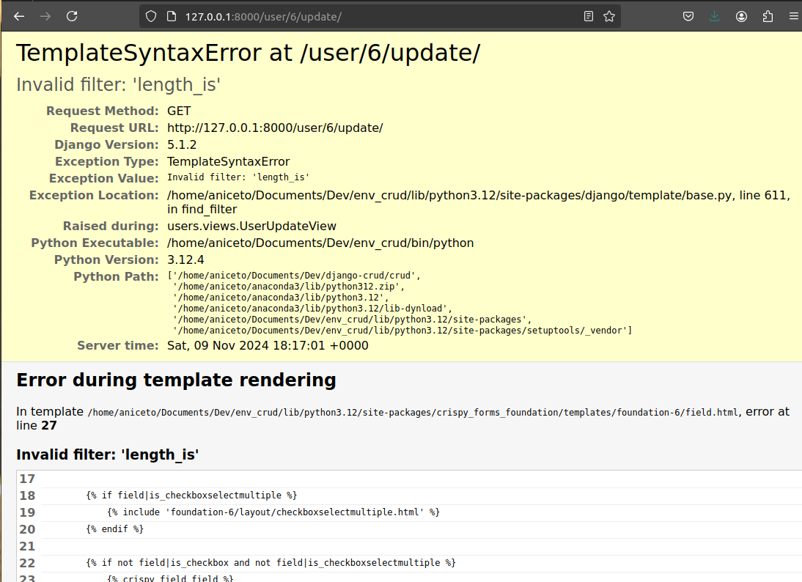
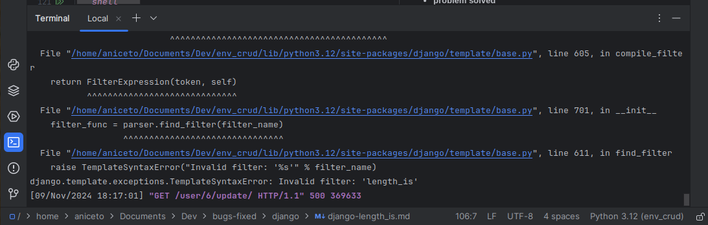
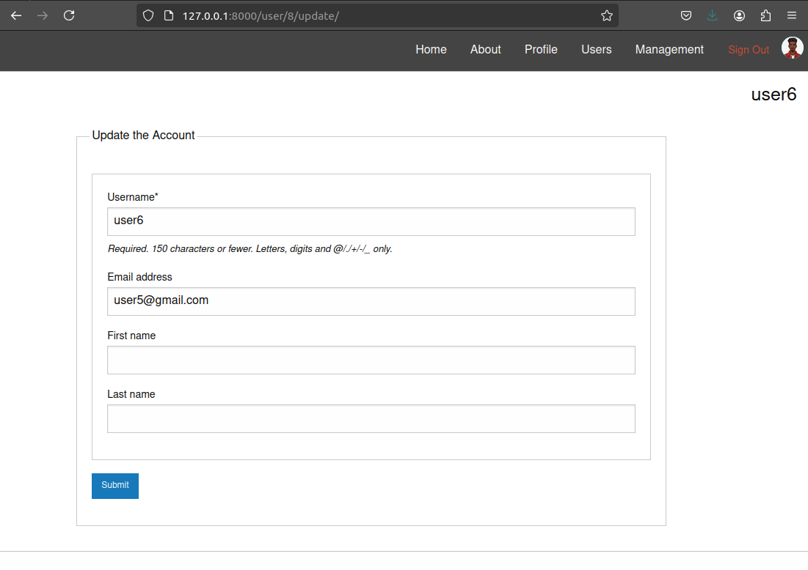

# <p align='center'> TemplateSyntaxError at /user/6/update/ <br/> Invalid filter: 'length_is' </p>


## <p align='center'> Bug 🐞 </p>

```shell

TemplateSyntaxError at /user/6/update/

Invalid filter: 'length_is'

Request Method: 	GET
Request URL: 	http://127.0.0.1:8000/user/6/update/
Django Version: 	5.1.2
Exception Type: 	TemplateSyntaxError
Exception Value: 	

Invalid filter: 'length_is'

Exception Location: 	/home/aniceto/Documents/Dev/env_crud/lib/python3.12/site-packages/django/template/base.py, line 611, in find_filter
Raised during: 	users.views.UserUpdateView
Python Executable: 	/home/aniceto/Documents/Dev/env_crud/bin/python
Python Version: 	3.12.4
Python Path: 	

['/home/aniceto/Documents/Dev/django-crud/crud',
 '/home/aniceto/anaconda3/lib/python312.zip',
 '/home/aniceto/anaconda3/lib/python3.12',
 '/home/aniceto/anaconda3/lib/python3.12/lib-dynload',
 '/home/aniceto/Documents/Dev/env_crud/lib/python3.12/site-packages',
 '/home/aniceto/Documents/Dev/env_crud/lib/python3.12/site-packages/setuptools/_vendor']

Server time: 	Sat, 09 Nov 2024 18:17:01 +0000
Error during template rendering

In template /home/aniceto/Documents/Dev/env_crud/lib/python3.12/site-packages/crispy_forms_foundation/templates/foundation-6/field.html, error at line 27
Invalid filter: 'length_is'
17 	
18 	        
19 	            
20 	        
21 	
22 	        
23 	            
24 	        
25 	
26 	        
27 	            <span id="abide_error_{{ field.auto_id }}" class="form-error compact" data-form-error-for="{{ field.id_for_label }}">
28 	                {{ field.field.abide_msg }}
29 	            </span>
30 	        
31 	
32 	        
33 	            
34 	                <span id="error_{{ forloop.counter }}_{{ field.auto_id }}" class="form-error is-visible compact">
35 	                    {{ error }}
36 	                </span>
37 	            
```
#
<p>Problem Identification: <br>
<span style="color:red"> Invalid filter: 'length_is' </span>
</p>
The specific line causing the error is found in the 

`crispy_forms_foundation` package:

```html
<span id="abide_error_{{ field.auto_id }}" class="form-error compact" data-form-error-for="{{ field.id_for_label }}">

```

The error **TemplateSyntaxError**: Invalid filter: 'length_is' indicates that your Django template is attempting to use a filter that has been removed in Django 5.1. The length_is filter was deprecated in Django 4.2 and is no longer available, which leads to this error during template rendering.

## <p align='center'> Solution 🎉 </p>


To resolve this issue, you need to replace the `length_is` filter with a combination of the `length` filter and a comparison operator. Here’s how you can modify that line:

#### Updated Line
Change the problematic line to:

````html
<span id="abide_error_{{ field.auto_id }}" class="form-error compact" data-form-error-for="{{ field.id_for_label }}">

````

#### Steps to Implement the Change
1. Locate the Template File:
- Find the file where this line is located, which is indicated as `/home/aniceto/Documents/Dev/env_crud/lib/python3.12/site-packages/crispy_forms_foundation/templates/foundation-6/field.html`.
2. Edit the File:
- Open the file and navigate to line 27.
- Replace `field.errors|length_is:"0"` with `field.errors|length == 0`.
3. Check Other Instances:
- Search for any other occurrences of length_is within your templates or any other included templates from third-party packages.
4. Update Third-Party Packages:
- If you are using an older version of `crispy_forms_foundation`, consider updating it to a newer version that may have resolved this issue. You can check for updates using pip:

```shell
  pip install --upgrade crispy-forms-foundation
```
5. After making these changes, restart your Django development server and test your application to ensure that the error no longer occurs.
- After making these changes, restart your Django development server and test your application to ensure that the error no longer occurs.
#

### Old - New



###
### problem solved

```shell
(env_crud) (base) aniceto@aniceto-HP-ProBook-4530s:~/Documents/Dev/django-crud/crud$ python manage.py runserver
Watching for file changes with StatReloader
Performing system checks...

Dir actualy! /home/aniceto/Documents/Dev/django-crud/crud/media/profile_pics
System check identified no issues (0 silenced).
November 09, 2024 - 20:09:03
Django version 5.1.2, using settings 'crud.settings'
Starting development server at http://127.0.0.1:8000/
Quit the server with CONTROL-C.
```


#

###### Author : Aniceto Jolela 🥰
 My  | [Linkedin](https://www.linkedin.com/in/aniceto-jolela-076547184/))
