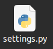
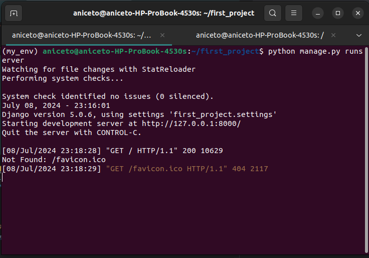
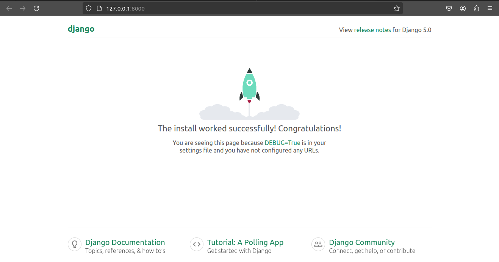

# <p align='center'> Exception in thread django main thread </p>


## <p align='center'> Bug 🐞 </p>

```shell
(my_env) aniceto@aniceto-HP-ProBook-4530s:~/first_project$ python manage.py runserver
Watching for file changes with StatReloader
Exception in thread django-main-thread:

Traceback (most recent call last):
  File "/usr/local/lib/python3.12/threading.py", line 1073, in _bootstrap_inner
    self.run()
  File "/usr/local/lib/python3.12/threading.py", line 1010, in run
    self._target(*self._args, **self._kwargs)
  File "/home/aniceto/my_env/lib/python3.12/site-packages/django/utils/autoreload.py", line 64, in wrapper
    fn(*args, **kwargs)
  File "/home/aniceto/my_env/lib/python3.12/site-packages/django/core/management/commands/runserver.py", line 125, in inner_run
    autoreload.raise_last_exception()
  File "/home/aniceto/my_env/lib/python3.12/site-packages/django/utils/autoreload.py", line 87, in raise_last_exception
    raise _exception[1]
  File "/home/aniceto/my_env/lib/python3.12/site-packages/django/core/management/__init__.py", line 394, in execute
    autoreload.check_errors(django.setup)()
  File "/home/aniceto/my_env/lib/python3.12/site-packages/django/utils/autoreload.py", line 64, in wrapper
    fn(*args, **kwargs)
  File "/home/aniceto/my_env/lib/python3.12/site-packages/django/__init__.py", line 24, in setup
    apps.populate(settings.INSTALLED_APPS)
  File "/home/aniceto/my_env/lib/python3.12/site-packages/django/apps/registry.py", line 116, in populate
    app_config.import_models()
  File "/home/aniceto/my_env/lib/python3.12/site-packages/django/apps/config.py", line 269, in import_models
    self.models_module = import_module(models_module_name)
                         ^^^^^^^^^^^^^^^^^^^^^^^^^^^^^^^^^
  File "/usr/local/lib/python3.12/importlib/__init__.py", line 90, in import_module
    return _bootstrap._gcd_import(name[level:], package, level)
           ^^^^^^^^^^^^^^^^^^^^^^^^^^^^^^^^^^^^^^^^^^^^^^^^^^^^
  File "<frozen importlib._bootstrap>", line 1387, in _gcd_import
  File "<frozen importlib._bootstrap>", line 1360, in _find_and_load
  File "<frozen importlib._bootstrap>", line 1331, in _find_and_load_unlocked
  File "<frozen importlib._bootstrap>", line 935, in _load_unlocked
  File "<frozen importlib._bootstrap_external>", line 995, in exec_module
  File "<frozen importlib._bootstrap>", line 488, in _call_with_frames_removed
  File "/home/aniceto/my_env/lib/python3.12/site-packages/django/contrib/auth/models.py", line 3, in <module>
    from django.contrib.auth.base_user import AbstractBaseUser, BaseUserManager
  File "/home/aniceto/my_env/lib/python3.12/site-packages/django/contrib/auth/base_user.py", line 59, in <module>
    class AbstractBaseUser(models.Model):
  File "/home/aniceto/my_env/lib/python3.12/site-packages/django/db/models/base.py", line 143, in __new__
    new_class.add_to_class("_meta", Options(meta, app_label))
  File "/home/aniceto/my_env/lib/python3.12/site-packages/django/db/models/base.py", line 371, in add_to_class
    value.contribute_to_class(cls, name)
  File "/home/aniceto/my_env/lib/python3.12/site-packages/django/db/models/options.py", line 243, in contribute_to_class
    self.db_table, connection.ops.max_name_length()
                   ^^^^^^^^^^^^^^
  File "/home/aniceto/my_env/lib/python3.12/site-packages/django/utils/connection.py", line 15, in __getattr__
    return getattr(self._connections[self._alias], item)
                   ~~~~~~~~~~~~~~~~~^^^^^^^^^^^^^
  File "/home/aniceto/my_env/lib/python3.12/site-packages/django/utils/connection.py", line 62, in __getitem__
    conn = self.create_connection(alias)
           ^^^^^^^^^^^^^^^^^^^^^^^^^^^^^
  File "/home/aniceto/my_env/lib/python3.12/site-packages/django/db/utils.py", line 193, in create_connection
    backend = load_backend(db["ENGINE"])
              ^^^^^^^^^^^^^^^^^^^^^^^^^^
  File "/home/aniceto/my_env/lib/python3.12/site-packages/django/db/utils.py", line 113, in load_backend
    return import_module("%s.base" % backend_name)
           ^^^^^^^^^^^^^^^^^^^^^^^^^^^^^^^^^^^^^^^
  File "/usr/local/lib/python3.12/importlib/__init__.py", line 90, in import_module
    return _bootstrap._gcd_import(name[level:], package, level)
           ^^^^^^^^^^^^^^^^^^^^^^^^^^^^^^^^^^^^^^^^^^^^^^^^^^^^
  File "/home/aniceto/my_env/lib/python3.12/site-packages/django/db/backends/sqlite3/base.py", line 10, in <module>
    from sqlite3 import dbapi2 as Database
  File "/usr/local/lib/python3.12/sqlite3/__init__.py", line 57, in <module>
    from sqlite3.dbapi2 import *
  File "/usr/local/lib/python3.12/sqlite3/dbapi2.py", line 27, in <module>
    from _sqlite3 import *
ModuleNotFoundError: No module named '_sqlite3'

```
#
<p>Cause of the problem: <br>
<span style="color:red"> ModuleNotFoundError: No module named '_sqlite3' </span>
</p>

- If you have a database on your machine you will have to configure it in Django file **settings.py**.

- For those who have no database in their machine have to comment on Django file **settings.py** database data.


## <p align='center'> Solution 🎉 </p>

<p align="center"> enter your project folder and open the <b style="color:purple">settings.py</b> file.</p>



<p align='center'>  Search the database and comment.</p>

- **Step 1 - Old**
 ```py
    # Database
    # https://docs.djangoproject.com/en/5.0/ref/settings/#databases

    DATABASES = {
        'default': {
            'ENGINE': 'django.db.backends.sqlite3',
            'NAME': BASE_DIR / 'db.sqlite3',
        }
    }
```
- **Step 2 - New**
 ```py
    # Database
    # https://docs.djangoproject.com/en/5.0/ref/settings/#databases

   """ 
   DATABASES = {
        'default': {
            'ENGINE': 'django.db.backends.sqlite3',
            'NAME': BASE_DIR / 'db.sqlite3',
        }
    }
    """
```
- **problem solved**
```shell
    (my_env) aniceto@aniceto-HP-ProBook-4530s:~/first_project$ python manage.py runserver
    Watching for file changes with StatReloader
    Performing system checks...
    
    System check identified no issues (0 silenced).
    July 08, 2024 - 23:16:01
    Django version 5.0.6, using settings 'first_project.settings'
    Starting development server at http://127.0.0.1:8000/
    Quit the server with CONTROL-C.

```




#

###### Author : Aniceto Jolela 🥰
 My  | [Linkedin](https://www.linkedin.com/in/aniceto-jolela-076547184/))
