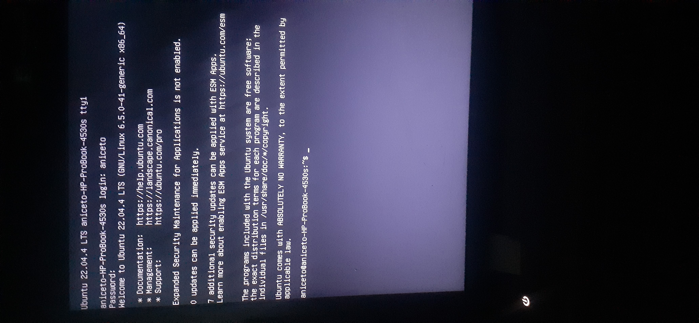
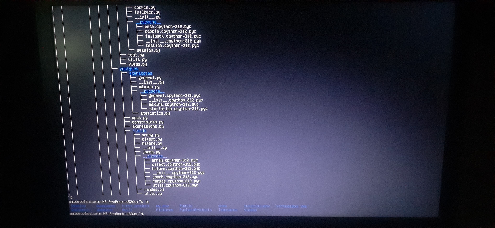
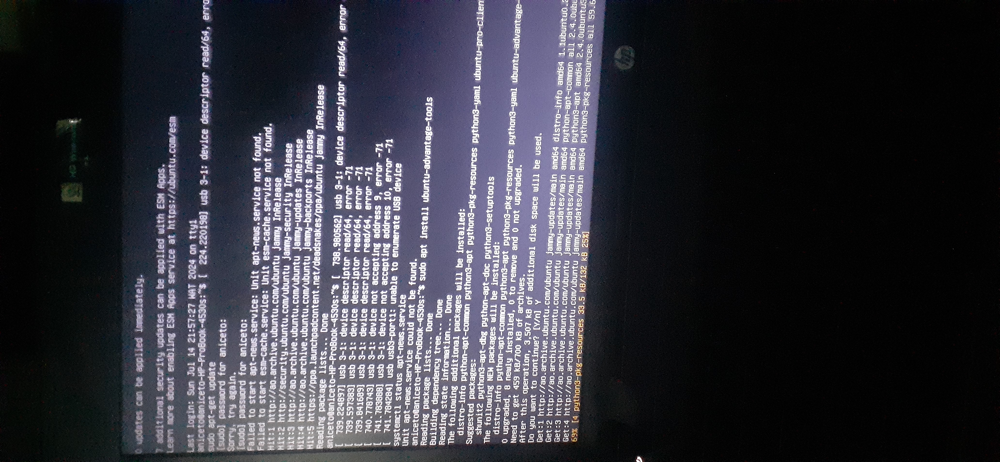

# Reinstall the graphic environment of ubuntu

> [!NOTE]
I was facing a problem with `SQLite3` using Django.
However, I decided to uninstall the python of my machine to install it again,
I did the whole process and restarted my machine.
> 
> After booting the operating system `(Ubuntu)`, I lost the **graphic environment**,
it was only possible to encode in the prompt, 
I tried to run an application was not opened for lack of the interface.

## I will show how I solved this problem

> [!WARNING]
> 
> ### Before
> 
> <details>
>   <summary>Assets</summary>
>
> 
> 
> </details>
>

###### Restart the graphic environment:

> [!TIP]
> 
>  ### After
> 
> - Press the Ctrl + Alt + F2 keys to enter terminal mode.
> - Make login with your username and password.
> - Then reinstall the graphic environment with the following command:
> ```shell
>   sudo apt-get install --reinstall ubuntu-desktop
> ```
> - restart the system with:
> ```shell
>   sudo shutdown -r now
> ```
> 
> <details>
>   <summary>Assets</summary>
>
> 
> [4.mp4](../assets/linux/ubuntu/not-ui/4.mp4)
> </details>

###### Alternative

- If the graphic environment does not yet carry, you can try the following:
```shell
sudo systemctl set-default graphical.target
```