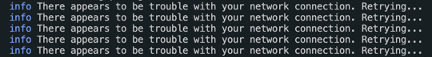

# <p align='center'> Yarn - There appears to be trouble with your network connection. Retrying </p>

## <p align='center'> Bug 🐞 </p>

<div align='center'>



</div>

## <p align='center'> Solution 🎉 </p>

<p align='center'>  Run below command in npm command prompt or Visual Studio Code terminal.</p>

 ```
    yarn config delete https-proxy
    yarn config delete proxy
```


###### Author : Aniceto Jolela 🥰
 My  | [Linkedin](https://www.linkedin.com/in/aniceto-jolela-076547184/))